# RSS News Aggregator

Проект выполнен в рамках дисплины **Инструментальные средства разработки ПО**.

## Стек технологий

- **Java 21** - последняя LTS-версия
- **Spring Boot 4.0.3**
- **Maven** - управление зависимостями и сборка проекта
- **Flyway** - миграции базы данных
- **PostgreSQL 17** - основная база данных
- **OpenAPI 3.0.3** - спецификация API
- **Docker Compose**
- **ROME** - библиотека для парсинга RSS-лент
- **Micrometer + Prometheus + Grafana** — метрики и мониторинг

---

## Как запустить

Требования:

- Docker Desktop
- Git
- JDK 21

### Windows

```
git clone https://github.com/CallistoCode443/RssAggregator.git

cd RssAggregator

./mvnw compile

docker-compose up -d

./mvnw spring-boot:run
```

Приложение запустится на http://localhost:8080

---

## Swagger UI

После запуска документация API доступна по адресу:

```
http://localhost:8080/swagger-ui/index.html
```

### OpenAPI в проекте

#### Описание

Файл **src/main/resources/openapi.yaml** описывает все эндпоинты, параметры и модели данных на языке OpenAPI 3.0.3. Например, эндпоинт получения статей выглядит следующим образом:

```yaml
paths:
  /api/articles:
    get:
      tags:
        - articles
      operationId: getArticles
      summary: Get paginated list of articles
      parameters:
        - name: category
          in: query
          required: false
          schema:
            type: string
        - name: sourceId
          in: query
          required: false
          schema:
            type: integer
            format: int64
        - name: q
          in: query
          required: false
          description: Search by title
          schema:
            type: string
        - name: from
          in: query
          required: false
          schema:
            type: string
            format: date-time
        - name: to
          in: query
          required: false
          schema:
            type: string
            format: date-time
        - name: page
          in: query
          required: false
          schema:
            type: integer
            default: 0
        - name: size
          in: query
          required: false
          schema:
            type: integer
            default: 20
        - name: sort
          in: query
          required: false
          schema:
            type: string
      responses:
        "200":
          description: Paginated list of articles
          content:
            application/json:
              schema:
                $ref: "#/components/schemas/ArticlePage"
```

#### Генерация

В pom.xml подключён плагин openapi-generator-maven-plugin. При запуске ./mvnw compile он читает openapi.yaml и автоматически генерирует Java-интерфейсы и DTO-классы в папку target/generated-sources/openapi/. Пример сгенерированного интерфейса ArticlesApi:

```java
@Generated(value = "org.openapitools.codegen.languages.SpringCodegen", date = "2026-03-18T10:47:43.346789700+03:00[Europe/Moscow]", comments = "Generator version: 7.20.0")
@Validated
@Controller
@Tag(name = "articles", description = "the articles API")
public interface ArticlesApi {

    String PATH_GET_ARTICLES = "/api/articles";
    /**
     * GET /api/articles : Get paginated list of articles
     *
     * @param category  (optional)
     * @param sourceId  (optional)
     * @param q Search by title (optional)
     * @param from  (optional)
     * @param to  (optional)
     * @param page  (optional, default to 0)
     * @param size  (optional, default to 20)
     * @param sort  (optional)
     * @return Paginated list of articles (status code 200)
     */
    @Operation(
        operationId = "getArticles",
        summary = "Get paginated list of articles",
        tags = { "articles" },
        responses = {
            @ApiResponse(responseCode = "200", description = "Paginated list of articles", content = {
                @Content(mediaType = "application/json", schema = @Schema(implementation = ArticlePage.class))
            })
        }
    )
    @RequestMapping(
        method = RequestMethod.GET,
        value = ArticlesApi.PATH_GET_ARTICLES,
        produces = { "application/json" }
    )
    ResponseEntity<ArticlePage> getArticles(
        @Parameter(name = "category", description = "", in = ParameterIn.QUERY) @Valid @RequestParam(value = "category", required = false) @Nullable String category,
        @Parameter(name = "sourceId", description = "", in = ParameterIn.QUERY) @Valid @RequestParam(value = "sourceId", required = false) @Nullable Long sourceId,
        @Parameter(name = "q", description = "Search by title", in = ParameterIn.QUERY) @Valid @RequestParam(value = "q", required = false) @Nullable String q,
        @Parameter(name = "from", description = "", in = ParameterIn.QUERY) @Valid @RequestParam(value = "from", required = false) @DateTimeFormat(iso = DateTimeFormat.ISO.DATE_TIME) @Nullable OffsetDateTime from,
        @Parameter(name = "to", description = "", in = ParameterIn.QUERY) @Valid @RequestParam(value = "to", required = false) @DateTimeFormat(iso = DateTimeFormat.ISO.DATE_TIME) @Nullable OffsetDateTime to,
        @Parameter(name = "page", description = "", in = ParameterIn.QUERY) @Valid @RequestParam(value = "page", required = false, defaultValue = "0") Integer page,
        @Parameter(name = "size", description = "", in = ParameterIn.QUERY) @Valid @RequestParam(value = "size", required = false, defaultValue = "20") Integer size,
        @Parameter(name = "sort", description = "", in = ParameterIn.QUERY) @Valid @RequestParam(value = "sort", required = false) @Nullable String sort
    );

}
```

#### Реализация

Контроллеры просто имплементируют сгенерированный интерфейс. Если в openapi.yaml добавить новый эндпоинт, компилятор сразу укажет, что контроллер не реализует новый метод. Пример реализации:

```java
@RestController
public class ArticlesController implements ArticlesApi {
   private final ArticleService articleService;

   public ResponseEntity<ArticlePage> getArticles(String category, Long sourceId, String q, OffsetDateTime from, OffsetDateTime to, Integer page, Integer size, String sort) {
      int pageNum = page != null ? page : 0;
      int pageSize = size != null ? size : 20;
      PageRequest pageable = PageRequest.of(pageNum, pageSize);
      ArticlePage result = this.articleService.getArticles(category, sourceId, q, from, to, pageable);
      return ResponseEntity.ok(result);
   }

   @Generated
   public ArticlesController(final ArticleService articleService) {
      this.articleService = articleService;
   }
}
```

## Метрики и мониторинг

В проекте настроен мониторинг через **Micrometer → Prometheus → Grafana**.

Помимо стандартных метрик JVM и HTTP реализованы три кастомные метрики. Для этого создан класс `RssMetrics` — он регистрирует счётчики и таймер через `MeterRegistry` из Micrometer:

```java
@Component
@RequiredArgsConstructor
public class RssMetrics {

    private final MeterRegistry registry;

    private Counter articlesSavedCounter;
    private Counter fetchErrorsCounter;
    private Timer fetchDurationTimer;

    @PostConstruct
    public void init() {
        articlesSavedCounter = Counter.builder("rss.articles.saved")
                .description("Количество сохранённых статей")
                .register(registry);

        fetchErrorsCounter = Counter.builder("rss.fetch.errors")
                .description("Количество ошибок при обходе источников")
                .register(registry);

        fetchDurationTimer = Timer.builder("rss.fetch.duration")
                .description("Время обхода одного источника")
                .register(registry);
    }

    public void incrementArticlesSaved(int count) { articlesSavedCounter.increment(count); }
    public void incrementFetchErrors() { fetchErrorsCounter.increment(); }
    public void recordFetchDuration(Runnable task) { fetchDurationTimer.record(task); }
}
```

Метрики подключены в планировщик `RssFetchScheduler` — каждый обход источника оборачивается в таймер, а ошибки считаются счётчиком:

```java
@Component
@RequiredArgsConstructor
@Slf4j
public class RssFetchScheduler {

    private final SourceService sourceService;
    private final ArticleService articleService;
    private final RssParser rssParser;
    private final RssMetrics rssMetrics;

    @Scheduled(cron = "${scheduling.rss-fetch-cron}")
    public void fetchAllSources() {
        List<Source> sources = sourceService.getActiveSources();

        for (Source source : sources) {
            rssMetrics.recordFetchDuration(() -> {
                try {
                    List<Article> articles = rssParser.parse(source);
                    articleService.saveNewArticles(source, articles);
                } catch (Exception e) {
                    rssMetrics.incrementFetchErrors();
                    log.error("Error fetching source '{}'", source.getName(), e);
                }
            });
        }
    }
}
```

### Кастомные метрики приложения

| Метрика                      | Тип     | Описание                                |
| ---------------------------- | ------- | --------------------------------------- |
| `rss_articles_saved_total`   | Counter | Количество сохранённых статей           |
| `rss_fetch_errors_total`     | Counter | Количество ошибок при обходе источников |
| `rss_fetch_duration_seconds` | Timer   | Время обхода одного источника           |

### Постой дашборд с полезными запросами, позволяющими оценить состояние приложения

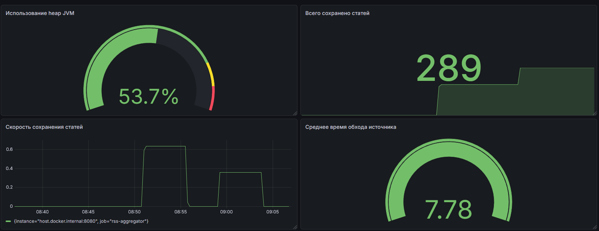

## Логирование

В проекте настроена отправка логов через **Logback → Grafana Loki**.

### Подключение зависимости

В `pom.xml` добавлен appender `loki4j`.

```xml
<dependency>
    <groupId>com.github.loki4j</groupId>
    <artifactId>loki-logback-appender</artifactId>
    <version>1.5.2</version>
</dependency>
```

### Конфигурация Logback

Файл `src/main/resources/logback-spring.xml` настраивает два appender-а: стандартный вывод в консоль и отправку в Loki.

```xml
<configuration>

  <appender name="CONSOLE" class="ch.qos.logback.core.ConsoleAppender">
    <encoder>
      <pattern>%d{HH:mm:ss} %-5level %logger{36} - %msg%n</pattern>
    </encoder>
  </appender>

  <appender name="LOKI" class="com.github.loki4j.logback.Loki4jAppender">
    <http>
      <url>http://localhost:3100/loki/api/v1/push</url>
    </http>
    <format>
      <label>
        <!-- Метки, по которым Loki индексирует потоки логов -->
        <pattern>app=rss-aggregator,level=%level,host=${HOSTNAME}</pattern>
      </label>
      <message>
        <!-- Формат каждой строки лога -->
        <pattern>%d{ISO8601} [%thread] %-5level %logger{36} - %msg%n</pattern>
      </message>
    </format>
  </appender>

  <root level="INFO">
    <appender-ref ref="CONSOLE" />
    <appender-ref ref="LOKI" />
  </root>

</configuration>
```

### Использование логгера в коде

Логгер подключается через аннотацию `@Slf4j` из Lombok — никаких дополнительных изменений в коде не требуется.

```java
@Component
@RequiredArgsConstructor
@Slf4j
public class RssFetchScheduler {
    private final SourceService sourceService;
    private final ArticleService articleService;
    private final RssParser rssParser;
    private final RssMetrics rssMetrics;

    @Scheduled(cron = "${scheduling.rss-fetch-cron}")
    public void fetchAllSources() {
        List<Source> sources = sourceService.getActiveSources();
        log.info("Starting RSS fetch for {} sources", sources.size());

        for (Source source : sources) {
            rssMetrics.recordFetchDuration(() -> {
                try {
                    List<Article> articles = rssParser.parse(source);
                    articleService.saveNewArticles(source, articles);
                    log.info("Fetched {} articles from '{}'", articles.size(), source.getName());
                } catch (Exception e) {
                    rssMetrics.incrementFetchErrors();
                    log.error("Failed to fetch source '{}': {}", source.getName(), e.getMessage(), e);
                }
            });
        }
    }
}
```

### Настройка Loki в docker-compose.yml

```yaml
grafana:
  image: grafana/grafana:latest
  container_name: grafana
  ports:
    - "3000:3000"
  environment:
    GF_SECURITY_ADMIN_PASSWORD: admin
  depends_on:
    - prometheus
    - loki
  volumes:
    - grafana_data:/var/lib/grafana

loki:
  image: grafana/loki:latest
  ports:
    - "3100:3100"
  command: -config.file=/etc/loki/local-config.yaml
  volumes:
    - loki_data:/loki
```

### Полезные LogQL-запросы

#### Все логи приложения

```logql
{app="rss-aggregator"}
```

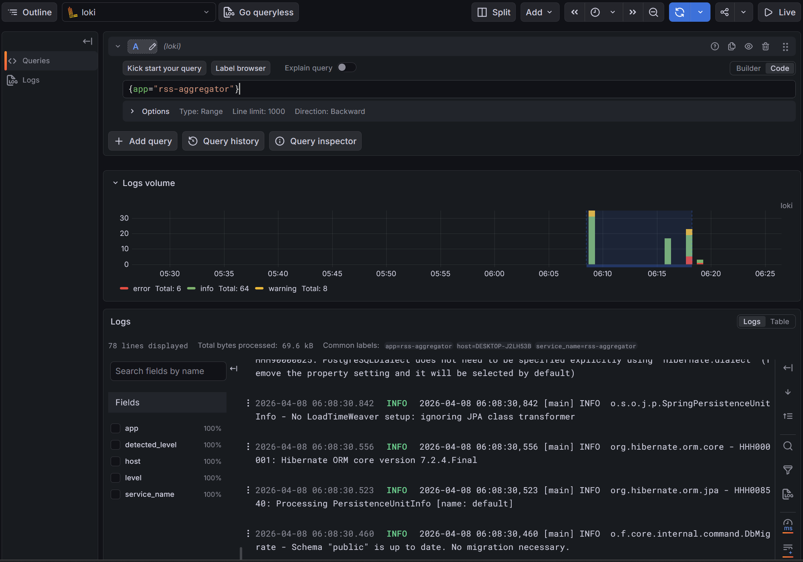

#### Только ошибки

```logql
{app="rss-aggregator", level="ERROR"}
```

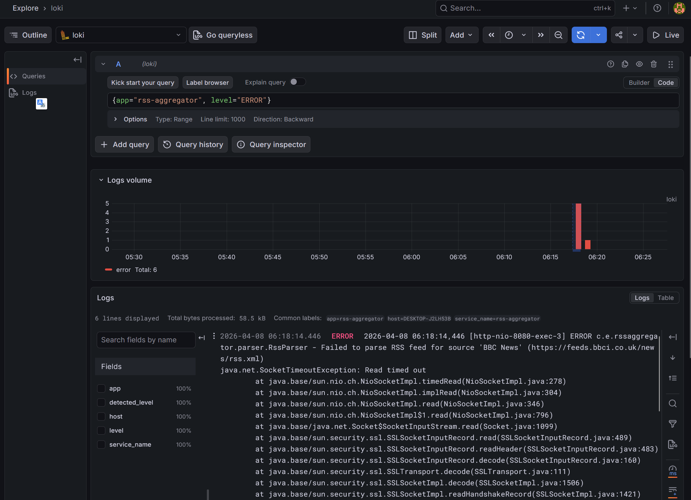

#### Ошибки с фильтром по тексту

```logql
{app="rss-aggregator", level="ERROR"} |= "Failed to fetch"
```

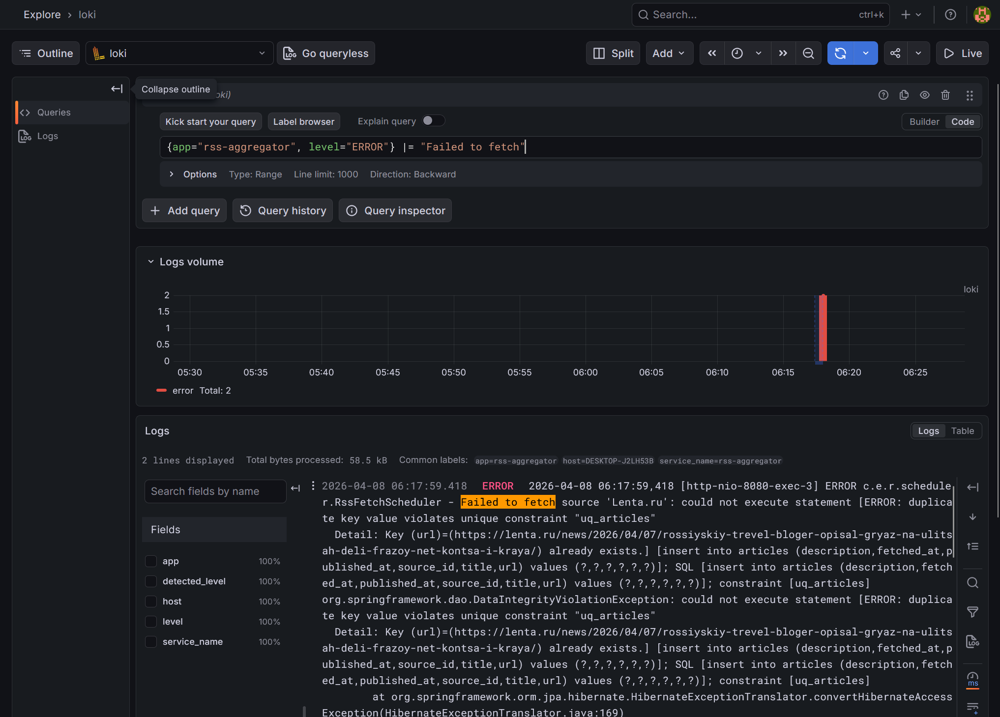

#### Количество ошибок за 10 минут

```logql
rate({app="rss-aggregator", level="ERROR"}[10m])
```

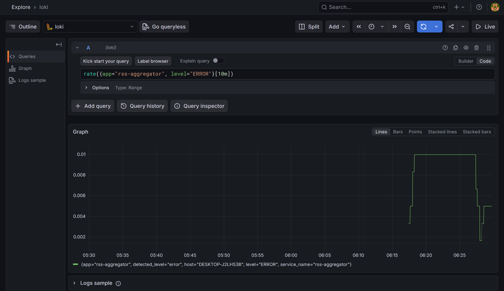

#### Логи конкретного источника

```logql
{app="rss-aggregator"} |= "Habr"
```

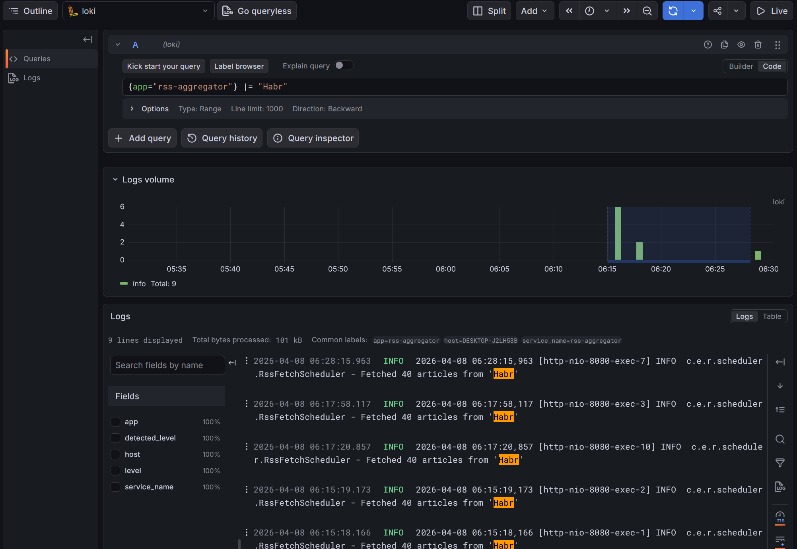

#### Все логи уровня WARN и выше за последний час

```logql
{app="rss-aggregator"} | level=~"WARN|ERROR"
```

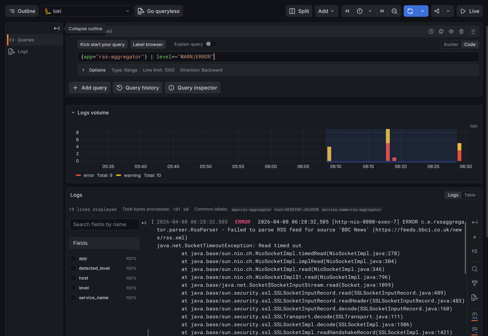

## Трассировка

В проекте настроена трассировка через **Micrometer Tracing → Grafana Tempo**. Каждый входящий HTTP-запрос и каждый обход RSS-источника получают уникальный `traceId`, по которому можно найти полный путь выполнения операции.

### Подключение зависимостей

В `pom.xml` добавляются следующие зависимостри:

```xml
<!-- Micrometer Tracing -->
<dependency>
    <groupId>io.micrometer</groupId>
    <artifactId>micrometer-tracing-bridge-brave</artifactId>
</dependency>

<!-- Zipkin reporter — отправка трейсов в Tempo -->
<dependency>
    <groupId>io.zipkin.reporter2</groupId>
    <artifactId>zipkin-reporter-brave</artifactId>
</dependency>
```

### Конфигурация в application.yml

```yaml
management:
  tracing:
    sampling:
      probability: 1.0

spring:
  zipkin:
    base-url: http://localhost:9411
    enabled: true
```

### Ручная инструментация планировщика

HTTP-запросы трассируются автоматически, но фоновые задачи (`@Scheduled`) нужно инструментировать вручную. Для этого в `RssFetchScheduler` инжектируется `Tracer`:

```java
@Component
@RequiredArgsConstructor
@Slf4j
public class RssFetchScheduler {
    private final SourceService sourceService;
    private final ArticleService articleService;
    private final RssParser rssParser;
    private final RssMetrics rssMetrics;
    private final Tracer tracer;

    @Scheduled(cron = "${scheduling.rss-fetch-cron}")
    public void fetchAllSources() {
        List<Source> sources = sourceService.getActiveSources();
        log.info("Starting RSS fetch for {} sources", sources.size());

        for (Source source : sources) {

            Span span = tracer.nextSpan()
                    .name("rss.fetch")
                    .tag("source.name", source.getName())
                    .tag("source.url", source.getUrl())
                    .start();

            try (Tracer.SpanInScope ws = tracer.withSpan(span)) {
                rssMetrics.recordFetchDuration(() -> {
                    try {
                        List<Article> articles = rssParser.parse(source);
                        articleService.saveNewArticles(source, articles);
                        span.tag("articles.count", String.valueOf(articles.size()));
                        log.info("Fetched {} articles from '{}'", articles.size(), source.getName());
                    } catch (Exception e) {
                        span.tag("error", e.getMessage());
                        rssMetrics.incrementFetchErrors();
                        log.error("Failed to fetch source '{}': {}", source.getName(), e.getMessage(), e);
                    }
                });
            } finally {
                span.end();
            }
        }
    }
}
```

### Настройка Tempo в docker-compose.yml

```yaml
services:
  tempo:
    image: grafana/tempo:latest
    container_name: tempo
    command: -config.file=/etc/tempo/tempo.yaml
    ports:
      - "3200:3200"
      - "9411:9411"
      - "9095:9095"
    volumes:
      - ./tempo.yaml:/etc/tempo/tempo.yaml
      - tempo_data:/var/tempo

volumes:
  tempo_data:
```

### Конфиг `tempo.yaml`:

```yaml
server:
  http_listen_port: 3200

distributor:
  receivers:
    zipkin:
      endpoint: 0.0.0.0:9411

storage:
  trace:
    backend: local
    local:
      path: /var/tempo/blocks
```

### Просмотр трейсов в Grafana

```traceql
# Все трейсы приложения
{ resource.service.name = "rssaggregator" }
```

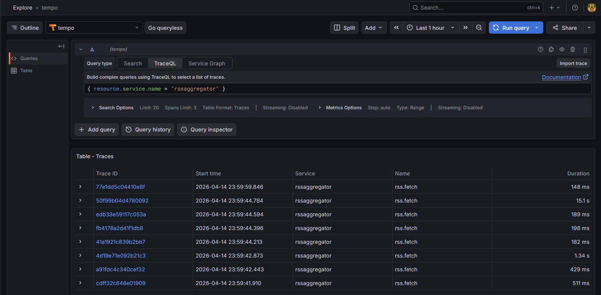

```traceql
# Трейсы дольше 2 секунд
{ resource.service.name = "rssaggregator" && duration > 2s }

```

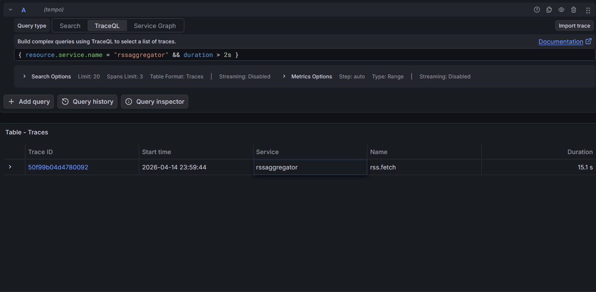

```traceql
# Трейсы с ошибками
{ resource.service.name = "rssaggregator" && status = error }
```

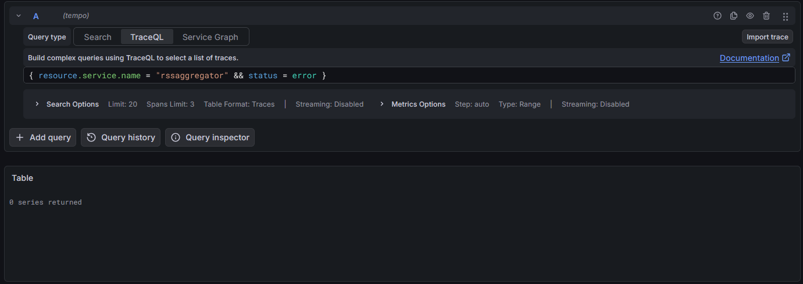

```traceql
{ span.source.name = "ria" }
```

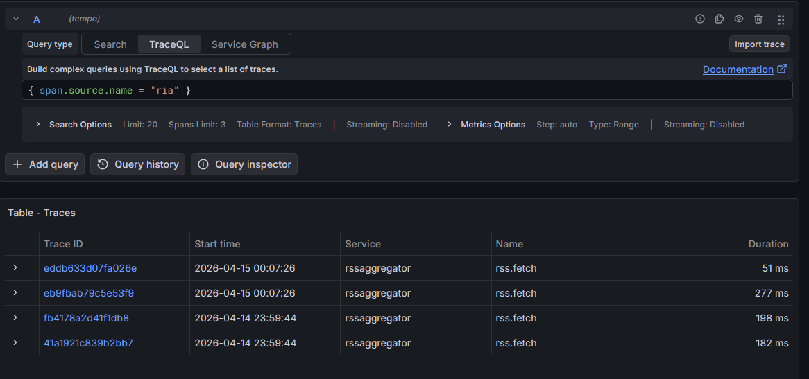